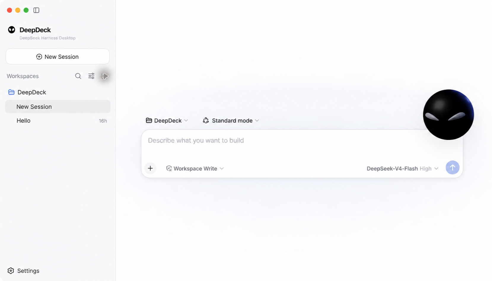
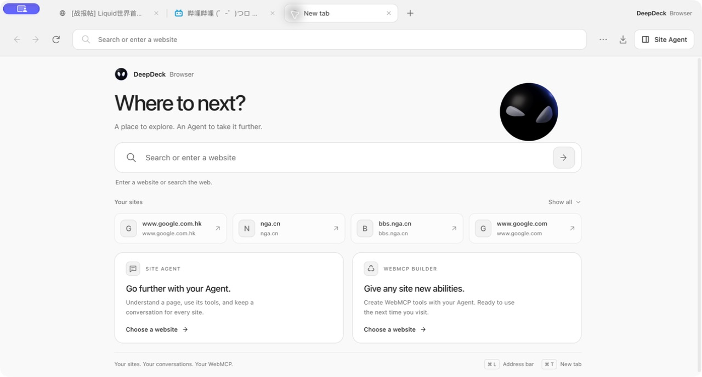
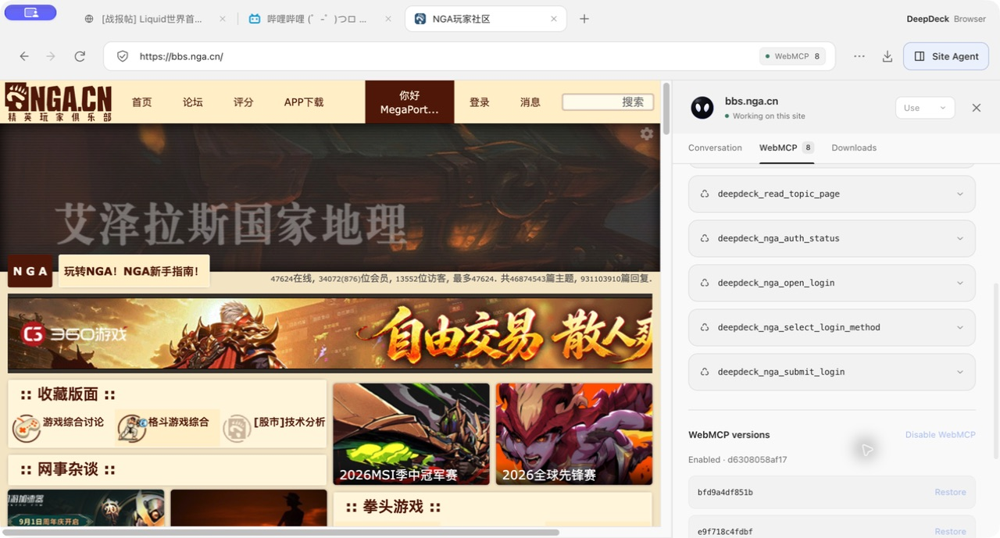

<p align="center">
  
</p>

<h1 align="center">DeepDeck</h1>

<p align="center">
  A native-feeling desktop client for DeepSeek Harness.
</p>



## Highlights

### Browser + WebMCP

**Available in [DeepDeck v1.0.38](https://github.com/jo32/DeepDeck/releases/tag/v1.0.38)** for Apple Silicon and Intel Macs.

Browse a website and work with its Agent in the same window. Each site keeps its own conversation and workspace, so reopening it resumes your work. **Use** and **Builder** share that conversation: use available tools, or ask Builder to inspect the page and add the missing capabilities.



- **Reusable site tools.** Discover tools a website already provides, or build WebMCP tools for its observed reading and interaction workflows. Enabled tools load again when you return to the site; their source and saved versions remain available for inspection and rollback.
- **Search, forms, and editing.** Builder looks for interactive controls as well as readable content. The Agent can read a draft, compose or revise it, write it back to the page, and verify the editor's state. Filling a field and submitting it are separate actions.
- **Login workflows.** Tools can open a site's real login UI, select an observed login method, and check its state. Passwords and verification codes stay in the website's native form. Available actions depend on the site and must be verified against its live page.



See the [Browser guide](plugins/browser/README.md) for details and the [website updates](https://deepdeck.getmegaportal.com/#updates) for feature announcements.

### Apps and the desktop workspace

- **Extend your workspace.** Discover and install Harness plugins from **Settings → Apps**, or build trusted local plugin source with **Bun Builder**.
- **Keep familiar Harness settings.** Use compatible profiles, model settings, credentials, and installed plugins in a desktop app with native browser tabs, downloads, and automatic update support.

## Architecture

DeepDeck is a native-feeling desktop client built on [DeepSeek Harness](https://github.com/deepseek-ai/deepseek-harness). The upstream project is pinned as a shallow Git submodule at `vendor/deepseek-harness`; this repository owns the desktop lifecycle, plugin-composed interface, branding, packaging, and automatic-update layer. [dsh-codex-connect](https://github.com/franksong2702/dsh-codex-connect) remains a separate pinned checkout and is preloaded as an ordinary Cordis bundle.

DeepDeck reuses the official `web` profile and its complete plugin-composed UI. The desktop host starts the Harness process on an OS-assigned loopback port, waits for it to become ready, then opens the local UI in the application window. Closing the app shuts the Harness process down cleanly.

Plugins can be discovered and installed from the dshfind-backed market in **Settings → Apps**. DeepDeck treats dshfind as a discovery catalog: it validates the selected GitHub repository and DSH bundle, previews the build plan, installs dependencies with lifecycle scripts disabled, and requires confirmation before running the plugin's own build script. Trusted local plugin source can also be compiled from **Settings → Plugins → Bun Builder**.

## First run

Prerequisites: Node.js `^22.19.0` or `>=24.0.0`, Corepack, and Git.

```sh
git submodule update --init --depth 1
pnpm install
pnpm bootstrap
pnpm start
```

`pnpm bootstrap` installs and builds the pinned Harness and Codex Connect sources, then builds the desktop app. Later `pnpm start` runs reuse the existing desktop artifacts while source, build configuration, and dependencies are unchanged; relevant changes or missing artifacts trigger a rebuild automatically. Use `pnpm start:rebuild` to force a desktop rebuild.

The desktop uses the standard Harness home (`$DSH_HOME`, or `~/.dsh` when unset), so profiles, model settings, credentials, patches, and installed plugins remain compatible with the upstream CLI. Set `DSH_HOME` before launch if an isolated desktop profile is desired.

## Branding

User-facing branding lives outside the upstream submodule in `branding/brand.json`. Replace the referenced wordmark, mark, favicon, and app icon files to rebrand the desktop without editing `vendor/deepseek-harness`. Set `DESKTOP_BRAND_PATH` to load a different manifest at launch.

## Useful commands

```sh
pnpm start             # reuse fresh artifacts, rebuild changed code, and launch
pnpm start:rebuild     # force a desktop rebuild and launch
pnpm start:packaged    # rebuild and launch the packaged desktop client
pnpm check             # type-check desktop main, preload, and renderer code
pnpm test              # run focused desktop tests
pnpm package:local     # build and verify an unsigned local macOS package
pnpm package:mac       # build signed production macOS packages
pnpm harness:build     # rebuild the pinned Harness checkout
```

See [docs/architecture.md](docs/architecture.md) for the dependency boundary and the plugin integration direction.

## Desktop updates

Packaged builds check for an update shortly after launch. When a release is available, the desktop sidebar shows an update indicator; the user starts the download explicitly and sees native updater progress. After the download completes, the desktop safely stops its Harness process, installs the update, and restarts automatically. Development launches do not contact an update service.

`electron-updater` reads the release provider generated into `app-update.yml` by the packaging pipeline. `DEEPSEEK_DESKTOP_UPDATE_URL` can override that provider with a generic HTTP(S) feed for controlled builds and update testing. Production updates are published to `https://deepdeck-updates.getmegaportal.com`. The feed contains platform metadata, signed artifacts, and blockmaps; macOS releases include the ZIP update target alongside the DMG.

See [docs/release.md](docs/release.md) for the signed release process and rollback model.

## License

DeepDeck is available under the [MIT License](LICENSE). The pinned DeepSeek Harness submodule and other third-party dependencies retain their own licenses.
