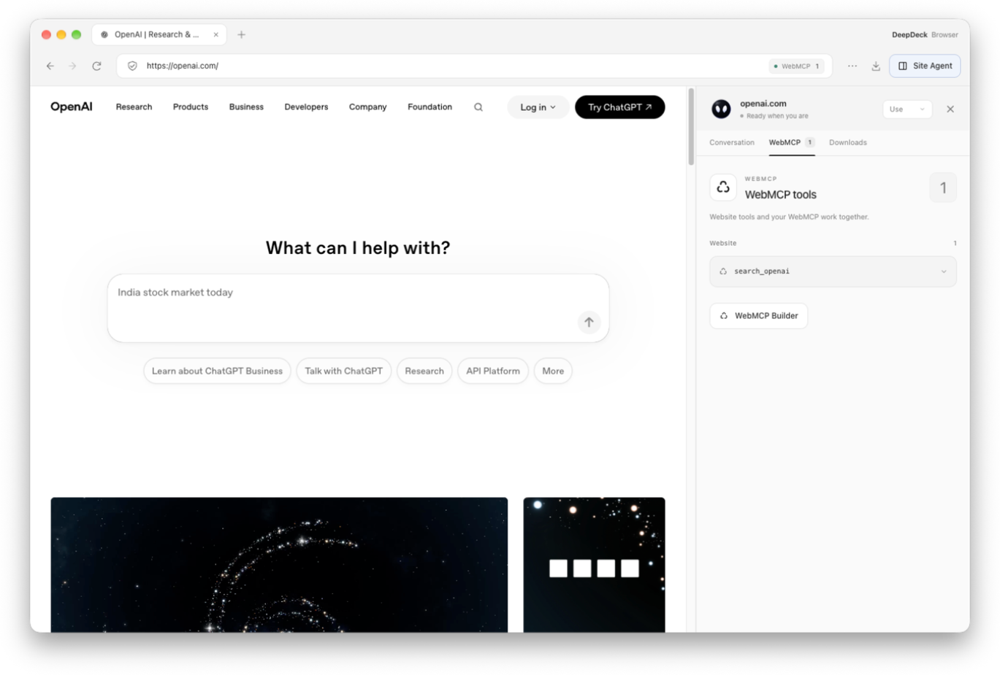
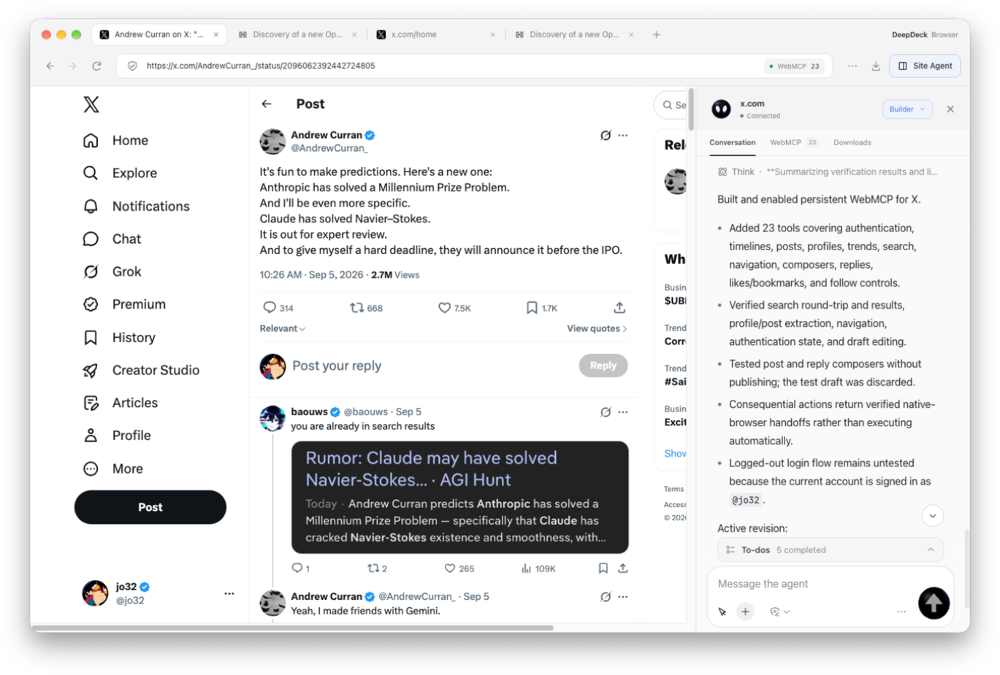
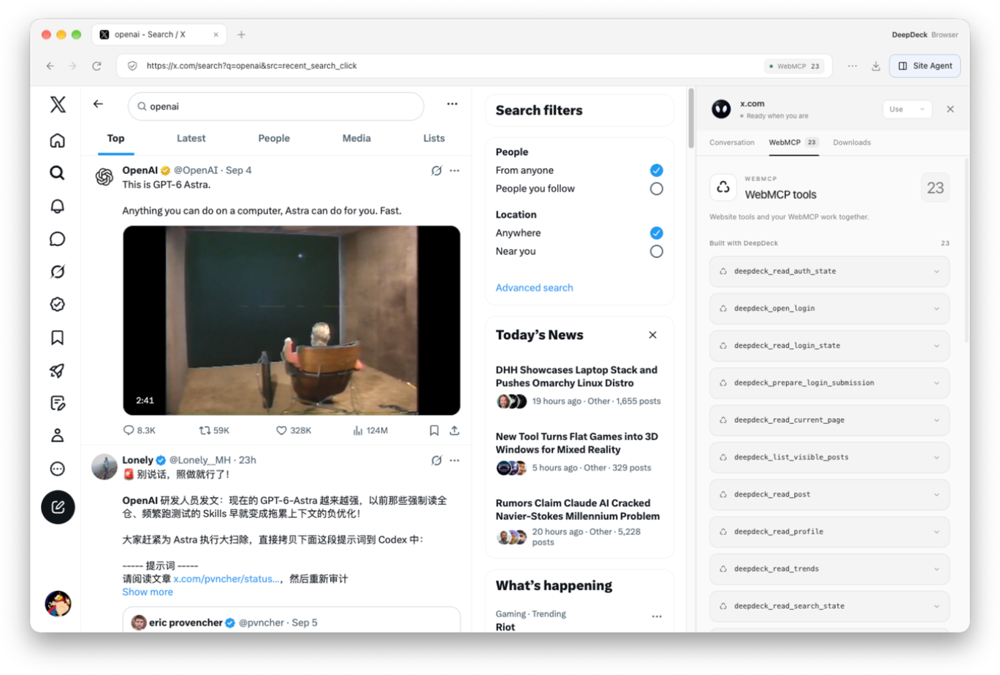
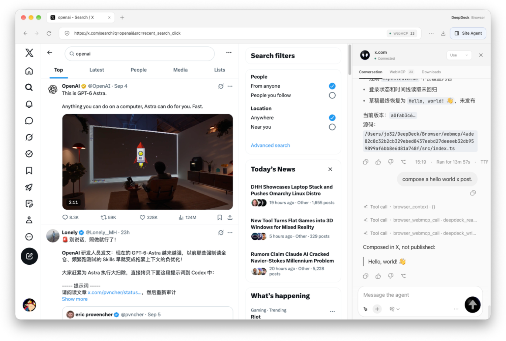

<p align="center">
  
</p>

<h1 align="center">DeepDeck</h1>

<p align="center">
  A native-feeling desktop client for DeepSeek Harness.
</p>


## Highlights

### Browser + WebMCP

**[Download the latest DeepDeck release](https://github.com/jo32/DeepDeck/releases/latest)** for Apple Silicon and Intel Macs.

**Let the Agent use a website, then keep what it learns as WebMCP tools.** You describe the goal. The Agent explores the real site, tries its workflows, checks the results, and saves the working operations as reusable tools. Building WebMCP is like preserving the Agent's experience of using the website, so future tasks can reuse it without a person writing step-by-step instructions.

That experience lives in inspectable, executable tools: how to search, read results, or edit and verify a draft. DeepDeck Browser supports both **reusing WebMCP tools that already exist** and **quickly building tools for websites that do not have them**, making existing products easier for agents to work with.

#### What is WebMCP?

[WebMCP](https://github.com/webmachinelearning/webmcp) is a proposed web API that lets websites expose JavaScript functions or HTML forms as tools with natural-language descriptions and structured input schemas. An agent can discover what a website does, supply the right arguments, and call its tools within the current page, sharing the user's browser context and visible interface. It complements backend MCP integrations.

With computer use, a model interprets screenshots or page snapshots, locates controls, clicks, types, and checks the result across multiple steps. WebMCP gives it explicit capabilities such as search, read a post, or edit a draft. For workflows covered by well-designed tools, fewer repeated page inspections and interaction rounds can mean **faster execution and lower token use**. The savings depend on the site, tools, and task; browser interaction remains available when needed. See the [WebMCP project's motivation and goals](https://github.com/webmachinelearning/webmcp#background-and-motivation).

#### 1. Reuse existing WebMCP

Open a website, select **Site Agent → WebMCP**, and inspect the tools discovered under **Website**. In **Use** mode, describe your task and the Agent can call the available tools. The screenshot below shows DeepDeck discovering `search_openai` on openai.com.



#### 2. Quickly add WebMCP to an existing website

For a site without WebMCP, open **WebMCP Builder** or switch the Site Agent to **Builder**. Describe the capabilities you want, for example: “Build WebMCP tools for this site so I can search, read posts, and edit drafts.” You provide the goal; the Agent works out how to use the site. Builder explores its real controls, tries the relevant workflows, and turns verified operations into tools. This saves that experience in DeepDeck without needing to modify the website's source or deploy a separate MCP server.



The X example produces **23 tools**, shown under **Built with DeepDeck**, including reading account state, posts, profiles, and search state. Website-provided tools and tools built with DeepDeck appear together, with their sources distinguished. Enabled tools are saved per website and load again when you return; source and saved versions remain available for inspection and rollback.



Switch back to **Use** and ask for the task. In this example, “compose a hello world x post” calls WebMCP tools to prepare **Hello, world! 👋** as a draft. **The post is not published**; filling and submitting are separate actions. Use and Builder share the site's conversation, so you can build the missing capability and continue your work in place.



**Explore → use → verify → save → reuse.** The Agent's work on a website becomes a reusable capability for the next task, helping an existing product become easier to use through an agent while keeping its familiar web interface.

See the [Browser guide](plugins/browser/README.md) for details and the [website updates](https://deepdeck.getmegaportal.com/#updates) for feature announcements.

### Apps and the desktop workspace

- **Extend your workspace.** Discover and install Harness plugins from **Settings → Apps**, or build trusted local plugin source with **Bun Builder**.
- **Keep familiar Harness settings.** Use compatible profiles, model settings, credentials, and installed plugins in a desktop app with native browser tabs, downloads, and automatic update support.

## Architecture

DeepDeck is a native-feeling desktop client built on [DeepSeek Harness](https://github.com/deepseek-ai/deepseek-harness). The upstream project is pinned as a shallow Git submodule at `vendor/deepseek-harness`; this repository owns the desktop lifecycle, plugin-composed interface, branding, packaging, and automatic-update layer. [dsh-codex-connect](https://github.com/franksong2702/dsh-codex-connect) remains a separate pinned checkout and is preloaded as an ordinary Cordis bundle.

DeepDeck reuses the official `web` profile and its complete plugin-composed UI. The desktop host starts the Harness process on an OS-assigned loopback port, waits for it to become ready, then opens the local UI in the application window. Closing the app shuts the Harness process down cleanly.

Plugins can be discovered and installed from the dshfind-backed market in **Settings → Apps**. DeepDeck treats dshfind as a discovery catalog: it validates the selected GitHub repository and DSH bundle, previews the build plan, installs dependencies with lifecycle scripts disabled, and requires confirmation before running the plugin's own build script. Trusted local plugin source can also be compiled from **Settings → Plugins → Bun Builder**.

## First run

Prerequisites: Node.js `^22.19.0` or `>=24.0.0`, Corepack, and Git.

```sh
git submodule update --init --depth 1
pnpm install
pnpm bootstrap
pnpm start
```

`pnpm bootstrap` installs and builds the pinned Harness and Codex Connect sources, then builds the desktop app. Later `pnpm start` runs reuse the existing desktop artifacts while source, build configuration, and dependencies are unchanged; relevant changes or missing artifacts trigger a rebuild automatically. Use `pnpm start:rebuild` to force a desktop rebuild.

The desktop uses the standard Harness home (`$DSH_HOME`, or `~/.dsh` when unset), so profiles, model settings, credentials, patches, and installed plugins remain compatible with the upstream CLI. Set `DSH_HOME` before launch if an isolated desktop profile is desired.

## Branding

User-facing branding lives outside the upstream submodule in `branding/brand.json`. Replace the referenced wordmark, mark, favicon, and app icon files to rebrand the desktop without editing `vendor/deepseek-harness`. Set `DESKTOP_BRAND_PATH` to load a different manifest at launch.

## Useful commands

```sh
pnpm start             # reuse fresh artifacts, rebuild changed code, and launch
pnpm start:rebuild     # force a desktop rebuild and launch
pnpm start:packaged    # rebuild and launch the packaged desktop client
pnpm check             # type-check desktop main, preload, and renderer code
pnpm test              # run focused desktop tests
pnpm package:local     # build and verify an unsigned local macOS package
pnpm package:mac       # build signed production macOS packages
pnpm harness:build     # rebuild the pinned Harness checkout
```

See [docs/architecture.md](docs/architecture.md) for the dependency boundary and the plugin integration direction.

## Desktop updates

Packaged builds check for an update shortly after launch. When a release is available, the desktop sidebar shows an update indicator; the user starts the download explicitly and sees native updater progress. After the download completes, the desktop safely stops its Harness process, installs the update, and restarts automatically. Development launches do not contact an update service.

`electron-updater` reads the release provider generated into `app-update.yml` by the packaging pipeline. `DEEPSEEK_DESKTOP_UPDATE_URL` can override that provider with a generic HTTP(S) feed for controlled builds and update testing. Production updates are published to `https://deepdeck-updates.getmegaportal.com`. The feed contains platform metadata, signed artifacts, and blockmaps; macOS releases include the ZIP update target alongside the DMG.

See [docs/release.md](docs/release.md) for the signed release process and rollback model.

## License

DeepDeck is available under the [MIT License](LICENSE). The pinned DeepSeek Harness submodule and other third-party dependencies retain their own licenses.
