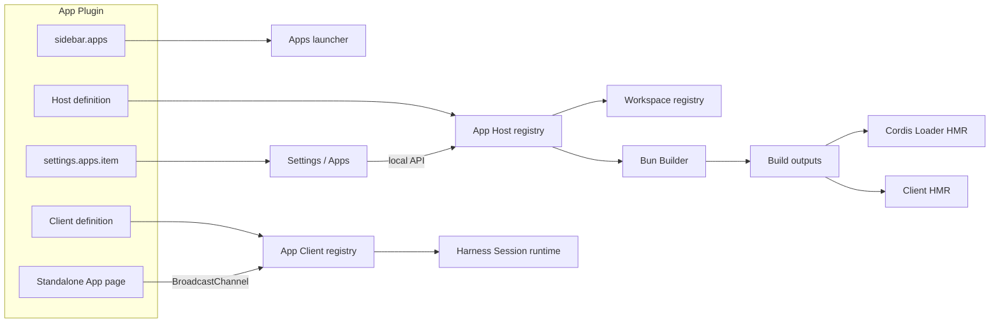
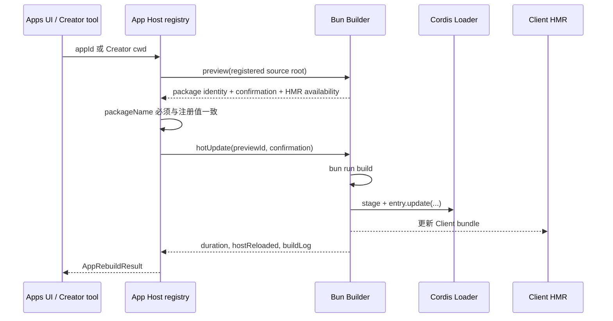

# DeepDeck Apps 协议

本文描述 DeepDeck 当前的 Apps 运行时协议，以及一个 Cordis 插件如何成为可启动、可配置、可对话、可 Vibe Coding、可用 Bun 热重载的 App。协议实现主要位于 [`app-conversations`](../plugins/app-conversations/) 和 [`bun-plugin-builder`](../plugins/bun-plugin-builder/)，[Hacker News Reader](https://github.com/jo32/dsh-hackernews-reader) 是独立维护的参考实现。

## 1. App、Plugin、Market 与 Builder 的边界

App 不是另一种独立的安装包格式，而是一个提供了 App 运行时能力的 Cordis Plugin。不是所有 Plugin 都是 App；一个完整 App 通常同时注册启动入口、Host 身份、Client actions 和可选设置。

| 模块 | 职责 | 不负责 |
| --- | --- | --- |
| Plugin | 提供 Cordis Host/Client 代码、工具、路由、设置和 patch | 不因安装后自动成为 App |
| App | 在 Plugin 基础上提供独立入口、App Workspace、设置和 App actions | 不自行复制 Harness 的 Session 状态 |
| Plugin Market | 发现、获取、安装或更新插件源码/包 | 不执行 App 的会话协议，也不替代 Builder |
| Bun Builder | 审核本地包身份，执行声明的 `build`，生成包或热更新已加载插件 | 不搜索市场、不 clone 仓库、不决定安装来源 |

运行时注册是事实来源：

- `sidebar.apps` 决定 App 是否出现在侧栏的 Apps 启动器中；
- Host `appConversations.register(...)` 决定 App 是否拥有 Workspace、Apps 设置卡、Vibe Coding 和 Rebuild 能力；
- Client `appConversations.register(...)` 决定独立 App 页面可以调用哪些 AI actions；
- `settings.apps.item` 决定该 App 是否有自己的设置内容。

`package.json` 中的 `dsh.app` 可以描述分发层的 App 身份，但仅有 manifest 不会产生运行时 UI；Plugin 仍需完成上述注册。

## 2. 总体架构



Host 和 Client 分工如下：

- Host 保存可信 App 身份、源码根目录和包名，创建 Workspace，并调用 Bun Builder；
- Client 把 App 页面 action 转成受控 prompt，复用 Harness 的标准 Session API，并向 App 页面回传预览状态；
- 独立 App 页面只负责交互和展示，不保存另一套对话状态；
- Electron 只负责打开原生次级窗口、聚焦主窗口等浏览器无法提供的桌面能力。

## 3. 注册一个 App

### 3.1 Host 注册

Host 通过反射服务 `appConversations` 注册 App：

```ts
import { fileURLToPath } from 'node:url'

const packageRoot = fileURLToPath(new URL('..', import.meta.url))

ctx.effect(() => ctx.appConversations.register({
  id: 'example-reader',
  title: 'Example Reader',
  workspaceSlug: 'example-reader',
  workspaceTitle: 'Apps · Example Reader',
  packageName: '@example/dsh-example-reader',
  sourcePackageRoot: packageRoot,
}), 'example reader: app registration')
```

字段约束：

| 字段 | 含义 | 约束 |
| --- | --- | --- |
| `id` | App 的稳定协议身份 | 小写字母、数字和连字符；当前进程内唯一 |
| `title` | Apps 设置和 Creator Workspace 的显示名 | 不得为空 |
| `workspaceSlug` | 普通 App Workspace 的目录名 | 与 `id` 相同的格式；不同 App 不得共用 |
| `workspaceTitle` | 普通 App Workspace 的显示名 | 可选；默认 `Apps · <title>` |
| `packageName` | Bun Builder 审核和 Loader 匹配使用的包名 | 必须与 `package.json.name` 完全一致 |
| `sourcePackageRoot` | Vibe Coding 和 Rebuild 使用的源码根目录 | 必须是绝对本地路径，不能是 Builder staging 目录 |

建议从 `import.meta.url` 推导 `sourcePackageRoot`，不要写开发机绝对路径。热更新后 Host 会从 Builder staging 目录重新注册；注册表只在包名一致时保留之前审核过的原始源码根目录，避免下一次 Rebuild 错误地指向临时目录。

### 3.2 Apps 启动器

Client 使用 `sidebar.apps` list slot 提供启动入口：

```tsx
ctx.slots.inject('sidebar.apps', () => ctx.slots.register({
  name: 'sidebar.apps',
  id: 'example-reader',
  order: 20,
  label: 'Example Reader',
}, ExampleReaderLauncher))
```

Launcher 会收到 `{ wide, closeApps }`。App 打开成功后应调用 `closeApps()`。需要原生次级窗口时，由 Host 的同源路由请求 Electron bridge；Client 不应直接操作 Electron。

### 3.3 App 自有设置

Apps 设置页由 `app-conversations` 统一提供。App 只向 `settings.apps.item` 注入自己的设置内容：

```tsx
ctx.slots.inject('settings.apps.item', () => ctx.slots.register({
  name: 'settings.apps.item',
  id: 'example-reader',
}, ExampleReaderSettings))
```

slot `id` 必须等于 App `id`。Settings 容器使用 `only: app.id` 渲染，因此一个 App 看不到或覆盖另一个 App 的设置。

每张 App 卡由三部分组成：

1. 标题、包名和 **Vibe Coding**；
2. App 自己贡献的设置；
3. 协议统一提供的 **Bun Builder / Rebuild with Bun**。


App 设置应使用 Harness UI primitives 和设计 token，不能硬编码只适用于 Light 或 Dark mode 的颜色。账号、Cookie 或 token 等凭据由 App 的 Host credential service 保存，不放进 Client state、Workspace 或 App 页面消息。

### 3.4 Client actions

独立 App 页面不能直接提交任意 prompt。Client 为固定 `actionId` 注册 payload 到 prompt 的转换函数：

```ts
ctx.effect(() => ctx.appConversations.register({
  id: 'example-reader',
  actions: {
    explain: payload => prepareExampleAction('explain', payload),
    summarize: payload => prepareExampleAction('summarize', payload),
  },
}), 'example reader: app actions')
```

转换函数返回：

```ts
interface AppConversationPreparedAction {
  prompt: string
  title: string
  sessionTitle?: string
}
```

转换函数负责验证和限制页面传入的 payload。协议还会拒绝空 prompt、超过 64 KiB 的 prompt，并把 Session 标题限制在 120 个字符内。

## 4. 两类 Workspace

Apps 协议故意把“使用 App”和“修改 App”分开：

| 类型 | 路径 | 默认标题 | Agent preset | 用途 |
| --- | --- | --- | --- | --- |
| App content Workspace | `~/DeepDeck/Apps/<workspaceSlug>` | `Apps · <title>` | 用户当前选择 | App actions 的标准 Session、历史和产物 |
| Creator Workspace | 注册的 `sourcePackageRoot` | `Creator · <title>` | 强制 `cordis` | 阅读和修改 App 源码、调用受控 Rebuild |

普通 App action 创建或复用 content Workspace 中的 canonical Session。follow-up 请求如果携带 `sessionId`，协议会验证该 Session 的 `cwd` 仍属于当前 App；App 页面不能把 action 注入其他 Workspace 的 Session。

点击 **Vibe Coding** 时，Client 请求 Host 解析 Creator Workspace，连接一个空白 Session，将 preset 切换为 `cordis`，然后在主窗口打开该 Session。Creator Workspace 直接指向源码包，不写入 `~/DeepDeck/Apps`。

## 5. 独立 App 页面消息协议

独立 App 页面与 DeepDeck 主页面使用同源 `BroadcastChannel` 通信：

```ts
const channelName = 'deepdeck-app-conversations-v1'
```

消息使用 `source`、`clientId` 和 `requestId` 做来源区分与请求关联。页面到运行时有两类消息：

| `type` | `source` | 作用 |
| --- | --- | --- |
| `invoke` | `deepdeck-app-page` | 调用一个已注册的 App action |
| `open-session` | `deepdeck-app-page` | 在主窗口打开一个已经属于该 App 的 Session |

`invoke` 示例：

```json
{
  "source": "deepdeck-app-page",
  "type": "invoke",
  "clientId": "page-instance-id",
  "requestId": "request-id",
  "appId": "example-reader",
  "actionId": "summarize",
  "payload": { "itemId": 42 },
  "openSession": false
}
```

运行时通过 `preview-state` 回传状态：

```json
{
  "source": "deepdeck-app-runtime",
  "type": "preview-state",
  "targetClientId": "page-instance-id",
  "requestId": "request-id",
  "appId": "example-reader",
  "status": "running",
  "sessionId": "session-id",
  "title": "Summarize item",
  "content": "Current assistant preview"
}
```

状态语义：

| 状态 | 含义 |
| --- | --- |
| `preparing` | 正在验证 action、准备 Workspace 和 Session |
| `running` | prompt 已接受；可能同时携带增量预览文本 |
| `attention` | Session 等待用户交互，应转到主窗口处理 |
| `completed` | 当前 turn 已完成 |
| `failed` | action、Session 或轮询失败；`error` 提供说明 |

`openSession: true` 表示 prompt 被接受后立即打开 canonical Session，不在 App 页面等待完整回答。否则 Client 最多轮询 10 分钟，并把 Assistant 的 durable message 或 live text delta 折叠成预览。

BroadcastChannel 是同源页面之间的传输机制，不是凭据通道。页面输入仍必须经过消息结构、App id、action id、payload 和 Session 所属关系验证。

## 6. Bun Rebuild 与 Cordis 热更新

Apps 设置里的 Rebuild 和 Creator tool 最终都进入同一个 Host 信任边界：



### 6.1 Settings Rebuild

Settings 页面只把 `appId` 发送到本地 API，不能提交源码路径、shell 命令或 build script。Host 从注册表取得可信 `sourcePackageRoot` 和 `packageName`，然后：

1. 建立 preview，读取并冻结包名、版本、Host/Client 入口和 `scripts.build`；
2. 确认当前 Cordis Loader 正在从同一个源码包加载该 package；
3. 再次验证 live manifest 没有改变审核过的 build plan；
4. 在原始源码目录运行内置 Bun 的 `bun run build`；
5. 验证构建后的 Host/Client 入口；
6. 把新 Host 输出复制到 Builder 管理的 staging 目录并调用 Loader `entry.update(...)`；
7. 由现有 Client HMR 通道加载新 Client bundle。

App Rebuild 是热更新快捷路径，**不会**执行 `bun install`，也**不会**生成 `.tgz`。Bun Builder 的通用“Build tgz”流程才会在隔离快照中执行 `bun install --ignore-scripts`、`bun run build` 和 `bun pm pack --ignore-scripts`。

Loader 更新失败时，旧 Host 保持活动；成功后才清理同一 package 的旧 staging 目录。Builder 不能在自己的请求执行中热更新自己。

### 6.2 Creator mode

`app-conversations` 只向选择了 `cordis` preset 的 agent scope 注册两个工具：

| Tool | 作用 |
| --- | --- |
| `deepdeck_app_context` | 返回当前 Creator Workspace 绑定的 App id、包名、可信源码根目录和 Rebuild 可用性 |
| `deepdeck_app_rebuild` | 对当前绑定 App 执行同一套 Bun build + Cordis HMR |

工具没有 `sourceDirectory` 或 `appId` 参数，而是从 Session header 的 `cwd` 解析 App，并要求它与注册源码目录的 realpath 完全一致。因此 Creator agent 不能借此构建任意目录；从其他入口打开的 Creator Session 也会被拒绝。


图中 2007 ms 是一次本地参考构建结果，不是协议 SLA。结果中的 `hostReloaded: true` 表示 Cordis Host 已切换到新输出；构建日志同时列出 Client 和 Host bundle。

## 7. 包与 patch 要求

一个可 Rebuild 的 App package 至少需要：

- `package.json.name` 与 Host 注册的 `packageName` 一致；
- 非空 `scripts.build`；
- `main` 指向构建后的 Host 入口；
- Client App 通过 `exports["./client"]` 和 `dsh.client` 声明 Client 入口及注入依赖；
- 类型出口和 `./invariant` 出口；
- App 自带 `cordis.patch.yml`，使安装后的 package 能被当前 profile 挂载；
- 生成的 `lib/` 不提交，但 `build` 必须能重建所有声明入口。

参考 manifest 片段：

```json
{
  "name": "@example/dsh-example-reader",
  "version": "0.1.0",
  "main": "lib/index.js",
  "types": "lib/types/index.d.ts",
  "exports": {
    ".": {
      "types": "./lib/types/index.d.ts",
      "default": "./lib/index.js"
    },
    "./client": {
      "types": "./lib/types/client/index.d.ts",
      "default": "./lib/client.js"
    },
    "./invariant": {
      "types": "./lib/types/invariant.d.ts",
      "default": "./lib/invariant.js"
    }
  },
  "dsh": {
    "app": {
      "id": "example-reader",
      "title": "Example Reader"
    },
    "bundle": {
      "patch": "./cordis.patch.yml"
    },
    "client": {
      "inject": ["@deepseek-ai/dsh-client-runtime"],
      "platform": "web"
    }
  },
  "scripts": {
    "build": "tsc -p tsconfig.json && tsdown --config tsdown.config.ts"
  }
}
```

最小自挂载 patch：

```yaml
- insert:
    - id: example-reader
      name: '@example/dsh-example-reader'
```

DeepDeck profile 提供 `app-conversations` 和 `bun-plugin-builder` 基础服务；App 自己的 patch 负责挂载 App Host/Client package。普通 Cordis plugin 也可以由外部 profile patch 挂载，但自带 patch 更适合 Market 安装和独立分发。

## 8. 本地 API 与安全边界

`app-conversations` 使用 `POST /api/deepdeck/app-conversations` 提供以下 action：

| action | 调用方 | 保护 |
| --- | --- | --- |
| `list-apps` | Apps 设置 | 返回非敏感 App descriptor |
| `rebuild` | Apps 设置 | 要求同源；路径和命令只能由 Host 注册表决定 |
| `resolve-workspace` | App Client | 只解析普通 App Workspace |
| `resolve-creator-workspace` | Vibe Coding | 要求 loopback + 同源 |
| `focus-main-window` | App Client | 只请求 Electron 聚焦主窗口 |

其他边界：

- API request body 上限为 32 KiB；
- App `id`、Workspace slug、package name 和绝对源码路径在 Host 注册时验证；
- Builder 拒绝符号链接源码根目录、与 Builder state 重叠的目录和超限源码树；
- Browser 不得传入 build command；执行的只能是 preview 中审核过的 package `scripts.build`；
- `scripts.build` 仍以当前用户权限执行本地代码，Builder 不是 sandbox；只应 Rebuild 可信源码；
- App 页面应使用同源 Host route、严格 CSP 和 `no-store`，不把 credential 注入 HTML 或 BroadcastChannel。

## 9. 生命周期与卸载

所有注册都必须放在 Cordis `ctx.effect(...)` 或 slot lifecycle 中，并返回 disposer。Plugin 被禁用、热更新或卸载时：

1. `sidebar.apps` 入口自动消失；
2. Host/Client App definition 从注册表移除；
3. App settings slot 被释放；
4. BroadcastChannel listener 随 `app-conversations` Client 生命周期关闭；
5. 已有 Workspace 和 Session 历史保留在磁盘，不因 Plugin 卸载而删除；
6. credentials 仍由 App credential service 的清理策略负责。

这使 App UI 跟随 Cordis plugin lifecycle，不需要 Electron 额外扫描 package 或维护重复状态。

## 10. 实现检查清单

- [ ] package 有 Host、Client、types、invariant 和 `cordis.patch.yml`
- [ ] `scripts.build` 可用 Bun 执行并生成声明的 Host/Client 入口
- [ ] Host 注册稳定 `id`、package name 和由 `import.meta.url` 推导的源码根目录
- [ ] Client 注册 `sidebar.apps`，成功打开后调用 `closeApps()`
- [ ] 有设置时使用 `settings.apps.item`，slot `id` 与 App `id` 一致
- [ ] App actions 使用固定 `actionId` 并验证 payload，不接受页面提供的任意 prompt
- [ ] 普通会话只使用 `~/DeepDeck/Apps/<slug>`，源码修改只使用 Creator Workspace
- [ ] App UI 使用设计 token，同时检查 Light 和 Dark mode
- [ ] 凭据只进入 Host credential service，不进入 Session、Client state 或页面消息
- [ ] Rebuild 不接受浏览器或 agent 提供的源码路径和 shell 命令
- [ ] 覆盖注册/释放、Workspace 所属、消息状态、Rebuild 可用与失败回滚测试

## 参考实现

- [Apps Host/Client contracts](../plugins/app-conversations/src/contracts.ts)
- [Apps Host registry 与本地 API](../plugins/app-conversations/src/index.ts)
- [Apps Client registry 与消息协议](../plugins/app-conversations/src/client/index.ts)
- [Apps 设置 section](../plugins/app-conversations/src/client/AppsSettingsSection.tsx)
- [Creator mode tools](../plugins/app-conversations/src/creator-tools.ts)
- [Bun Builder](../plugins/bun-plugin-builder/src/builder.ts)
- [Cordis Loader HMR adapter](../plugins/bun-plugin-builder/src/index.ts)
- [Hacker News Reader 参考 App](https://github.com/jo32/dsh-hackernews-reader)
