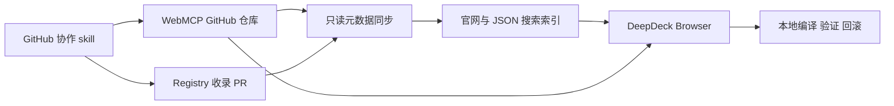

# GitHub 协作式 WebMCP 市场

状态：首版已在本地实现，尚未部署或创建实际社区项目。基于 `main@9ba9aae`，2026-09-10。

已实现：Browser 社区预览/安装/导出、按 commit 校验与本地编译、来源记录和回滚、随插件分发的 GitHub skill、双语目录网页、registry 引用与手动同步脚本。尚未实现：自动同步/webhook、结构化功能反馈聚合、自动关联修复 PR 与 Release、GitHub App 登录。后文保留这些后续设计；首版显示上游协作链接和同步时间，不生成未经证实的功能健康状态。

## 1. 产品边界

GitHub 是 WebMCP 源码、协作和版本的权威来源；DeepDeck 网站维护目录与发现信息，桌面负责构建、使用和本地验证。GitHub 发布及协作由 skill 编排，不把 GitHub 仓库管理重新做成一套产品后台。

| 载体 | 职责 |
| --- | --- |
| 项目的 GitHub 仓库 | 源码、manifest、许可、使用说明、贡献说明 |
| GitHub Issues / PR | 失效反馈、修复讨论、代码审查、协作维护 |
| GitHub Releases | 标记可安装版本，并解析到精确 commit |
| DeepDeck 网站 | 保存仓库引用，索引用途、目标网站、版本和维护状态；链接到上游协作 |
| DeepDeck Browser | 发现、安装、固定版本、本地验证、修改与回滚 |
| `deepdeck-webmcp-github` skill | 导出、发布仓库、提交修复 PR、发布 Release、申请目录收录 |

首次 Build 可以创建一个项目；修复已有工具时优先回到其上游提 PR。允许 fork，但显示来源和维护关系，让修复容易汇聚。同一站点可以有多个项目，不把先收录者视为站点官方或唯一维护者。

首版浏览、安装和使用无需 DeepDeck 账号。GitHub 写操作使用用户已有认证；网站不需要保存 GitHub 写 token，也不需要新建用户作品所有权体系。

## 2. 仓库约定与安装身份

首版采用一个仓库承载一个精确 HTTPS origin 的 WebMCP，目录允许填写 manifest 路径，以便以后兼容多包仓库。建议结构：

```text
webmcp.json
src/webmcp.ts
README.md
LICENSE
CONTRIBUTING.md
```

`webmcp.json` 描述名称、用途、origin、入口、版本、工具目录、SDK 版本、源码 SHA-256 和许可。字段见 [skill 的仓库约定](../.agents/skills/deepdeck-webmcp-github/references/repository-contract.md)。这是首版 Browser 已支持的 DeepDeck 分发约定，不是浏览器 WebMCP 标准；当前接受 `runtime: { id: "deepdeck-webmcp", sdkVersion: 1 }`。

目录稳定身份使用 GitHub repository ID + manifest path；URL 用于展示和定位，不单独承担身份。仓库改名后按 ID 更新 URL；同名地址换了 repository ID 时不能继承原条目。仓库转移所有者时记录变化并提示复核。

默认安装最新非草稿、非 prerelease 的兼容 Release。解析 tag 到完整 commit SHA，读取该 SHA 下的 manifest 与源码，校验 SHA-256，再用 DeepDeck 内置固定编译器本地构建。保存 repository ID、manifest path、Release ID、tag、commit、源码摘要、编译器及本地 revision。

Release/tag 的展示名不作为不可变内容身份；标签重指向不能静默改写已安装版本。没有 Release 的仓库仍可收录，显示“尚无稳定版”；高级用户明确选择 commit 后可以测试，不能把默认分支 HEAD 自动当成稳定版。

首版不依赖 Release 附件或服务端构建产物。只读取声明的普通文本文件，不执行仓库的安装脚本、workflow 或构建命令。现有单文件源码上限 512 KiB、产物上限 1 MiB、禁止 runtime imports/require 的限制继续适用。GitHub Contents API 可按 commit 读取公开内容，返回的临时下载 URL 不应持久化为包地址：[官方内容 API](https://docs.github.com/en/rest/repos/contents)。

## 3. 发布与协作流程

### 首次发布

1. 用户完成本地 Build，要求发布；skill 从明确的本地版本导出源码，整理 manifest、README、许可与贡献说明。
2. 若已有上游项目，先判断这次是给上游增加能力还是确实需要独立项目，避免自动创建重复仓库。
3. 使用已有 GitHub CLI、连接器或 git 认证，核对目标仓库与公开范围，提交经过检查的文件。
4. 创建指向精确提交的 Release。仓库推送成功、Release 发布成功、目录收录成功分别报告。
5. 向目录提交 GitHub 地址和 manifest path；目录读取仓库元数据，收录后生成详情页。

发布 skill 正文位于 `plugins/browser/skills/deepdeck-webmcp-github`，`.agents/skills/deepdeck-webmcp-github` 链接到同一来源。已通过 Cordis 在 Browser 的 Use/Builder 会话注册，包资源由现有 runtime 装配复制。

### 失效 → 修复 → PR → 新版

1. 用户使用工具失败时，先判断登录态、网络、目标页、权限和网站改版，未知结果不自动重放写操作。
2. 记录 origin、工具名、已安装 commit、DeepDeck 版本和脱敏复现步骤；同一版本的故障优先关联已有 Issue。
3. skill 根据用户请求准备 Issue 或在本地进入 Builder 修复。上传错误日志、截图或站点内容前，只保留复现必要且允许公开的信息。
4. 从已安装版本确定改动基线，在上游当前默认分支检查是否已有修复；在独立分支集成改动并重新验证。有权限向上游推分支时直接提 PR；没有权限时 fork 后提 PR。
5. PR 描述绑定实际测试提交、工具、场景和日期。只有编译/注册成功时不能声明功能恢复。
6. PR 合并后显示“修复已合并，等待发布”；包含修复提交的稳定 Release 发布后才提示“有修复版本”。合并本身不意味着用户已安装版本得到修复。
7. 用户查看源码与能力差异后更新，真实页面注册失败回滚。更新前保留本地未发布修改。

原维护者长期不响应时，可以继续维护 fork。网站展示上游与替代项目；维护者或目录审核者确认迁移关系后调整推荐，不能因为 fork 星数更多就静默切换安装来源。

## 4. 如何显示过时与可用性

“仓库最近更新”只能说明维护活动，不能证明目标站点仍可用。网站保存可追溯的状态摘要，链接到 Issue、PR 或验证记录：

| 状态维度 | 显示内容 |
| --- | --- |
| 源是否可访问 | 正常、已归档、已确认不可用、同步暂时失败 |
| 版本 | 最新稳定 Release、commit、发布时间；无稳定版 |
| 功能反馈 | 未验证、某版本被报告失效、维护者确认失效、某版本由某人验证可用 |
| 修复进度 | Issue 链接、待审 PR、已合并未发布、已发布修复 |
| 验证范围 | 工具名、验证 commit、时间、环境与报告者；不能只给全仓库一个绿色标记 |

社区报告与维护者结论分别显示；Issue 被关闭或 PR 合并不能自动清除故障。可建议仓库采用 `webmcp:broken`、`webmcp:verified` 等标签和结构化 Issue 模板，标签是仓库约定，不把任意标签当平台审核证明。首版复杂关联可由目录维护者整理，后续再自动化。

验证必须绑定代码或源码摘要；新的 Release 不能继承旧版验证。连续长时间没有验证可显示“近期未验证”，时间阈值作为可配置产品策略，不直接判定失效。登录账号、地区或 A/B 页面差异导致的结果允许并存。

搜索支持精确网站、任务用途、工具名、标签和维护者。先过滤 origin 和兼容性，再考虑相关性、版本对应的反馈、维护活动。星数作参考，不等于可用性。Browser 查询只上传用户主动选择的 origin，丢弃完整页面 URL 的 path/query/hash。

## 5. 极简存储服务

首版建议把目录也做成 GitHub 中的 registry 数据，网站生成可搜索索引。这样无需 PostgreSQL、R2、构建队列、独立账号、评论或收藏系统；Star、Watch、Issue 和 PR 继续在 GitHub 发生。

首版 registry 位于本仓库 `registry/webmcp/entries`，后续可以拆仓库。推送及官网部署前，远端目录和新页面仍不可视为已上线。



目录维护数据只包括：

- entry ID、repository ID、GitHub URL、manifest path、收录时间与目录状态。
- 人工精选或隐藏理由、上游/替代项目引用、需复核的迁移记录。

自动生成的索引缓存包括：

- 指定 commit 的名称、用途、origin、工具摘要、标签与许可。
- 已解析的 Release/tag/commit、manifest/source 摘要、兼容性。
- GitHub star 数、归档状态、Issue/PR 链接、带来源的验证摘要。
- `lastSyncedAt`、同步错误与缓存版本，方便区分上游失效和索引过期。

源码保存在 GitHub；网站不托管 bundle、用户会话、完整 Issue/PR 正文或用户网页数据。README 首版只链接到 GitHub，详情页展示经过长度限制的结构化纯文本摘要。

收录 PR 通过格式、仓库身份、manifest 与许可校验后合并；推荐状态不等于代码安全背书。第三方可以提交仓库收录，但不能因此取得仓库维护权。

元数据在目录变更后刷新，并设计定期增量同步；本次只写设计，不创建定时任务。对于已装 GitHub App 的仓库后续可增加 webhook。同步使用 ETag/条件请求、限并发和退避；索引原子替换，失败保留旧索引并显示时间。参考 [GitHub API 最佳实践](https://docs.github.com/en/rest/using-the-rest-api/best-practices-for-using-the-rest-api) 与 [API 限额](https://docs.github.com/en/rest/using-the-rest-api/rate-limits-for-the-rest-api)。

只访问从已校验 repository ID/路径构造的 GitHub API；校验重定向，不能把用户提交的地址直接作为通用抓取目标。目录条目中的 manifest entry 禁止绝对路径、路径穿越、符号链接和子模块。

规模变大后，索引可迁移到一张轻量目录表加搜索服务；保留 GitHub 为源码与协作权威。无需为了首次上线先引入数据库。

## 6. GitHub 登录是否需要做进 DeepDeck

首版不必先建设 DeepDeck 账号系统。skill 先检测现有 GitHub CLI/连接器/凭据；没有认证时完成本地准备并引导 GitHub 登录，不要求把 token 发进聊天。纯网页用户可通过 GitHub 模板仓库、上传和 PR 页面完成操作。

以后为了普通用户的一键发布体验，可以加“连接 GitHub”，优先评估 GitHub App 的指定仓库授权。身份登录与写仓库是不同权限：读身份不能推代码；Contents、Pull requests、Issues 按实际功能申请。创建新仓库、fork 或修改 workflow 的权限须按对应 API 单独验证，不能假设选中仓库的授权包含这些动作。[GitHub App 官方说明](https://docs.github.com/en/apps/creating-github-apps/about-creating-github-apps/about-creating-github-apps)

账号连接只解决认证，发布与协作判断仍由 skill 编排。原生凭据保管和外部登录窗口归 Electron，业务状态归 Cordis 插件；不修改 Harness vendor，不把 token 暴露给网站脚本。

## 7. 与现有 Browser 的衔接

现有 `WebMCPStore` 已提供单文件构建、不可变本地 revision、摘要验证和回滚；新增功能放在 `plugins/browser` 或专门的市场插件中。

需要补齐：

1. 从指定 revision 导出源码及摘要，避免把当前编辑稿当成已验证版本。
2. 仓库 manifest 校验和按 commit 下载源码；导入暂存后走现有编译、真实注册、激活流程。
3. 本地来源记录：repo ID、manifest path、Release/tag/commit、source digest、local revision、dirty 状态。
4. 市场发现、源码/更新预览、打开 Issue/PR，以及加载协作 skill 的入口。

目前每个精确 origin 只激活一套生成工具。安装其他项目必须明确替换并保存原版本，保留网站原生工具；首版不做多包合并。平台隔离 world 并不保证社区脚本只读，安装界面不能把行为声明显示成已强制执行的权限。

目录隐藏只能停止推荐；无法删除 GitHub 上的源码。已知恶意版本可在目录维护按 repo ID + commit/source digest 的撤销记录，客户端联网时检查并提示/禁用；离线已有工具无法即时收到变更。上游暂时不可访问时继续使用已安装本地版本，新的下载明确失败，不悄悄换源。

## 8. 实施顺序

1. **技能与约定**：仓库文件结构、首次发布/修复 PR/Release/收录 skill；已随 Browser 插件分发，未进行真实 GitHub 写操作。
2. **本地来源与导入导出**：指定 revision 导出、按 commit 安装、来源追踪、更新预览和失败回滚。
3. **目录网站**：registry、只读同步、搜索索引、当前站点发现和上游协作链接。
4. **维护体验**：失效报告与修复状态关联、维护 fork 展示；需要时加入 GitHub App 和 webhook。

实现代码提交前按仓库要求运行 `pnpm check`、`pnpm test`、`pnpm build`。关键验证包括移动 tag、仓库改名/转移/地址复用、API 限流、缺少 Release、PR 修复未发布、不同 commit 的反馈、本地未发布修改、注册失败恢复，以及真实 Browser 的相关 UI 状态。

## 9. 应用内市场与发布 skills（已实现，待发布）

通过 Browser Cordis 插件新增「设置 → WebMCP 市场」，内嵌同一份目录网页。握手成功后网页收起重复导航并显示安装按钮；宿主按 iframe 身份、来源和 nonce 校验消息，再从 GitHub 解析源码。预览和确认在宿主界面呈现，必要时打开源码声明的目标站点，真实注册成功才激活。

站外网页生成 DeepDeck 安装链接。Electron 只负责协议注册、冷启动/运行中接收和将请求交给插件预览，不自动安装。此系统级能力需要安装带该功能的打包版本；本次仅完成本地实现，未部署网页或发布安装包。

目录和安装来源记录维护者的 GitHub login，头像与账号链接由该 login 派生；仓库维护者不等于目标网站的作者。Browser 工具面板、来源和预览中显示该信息。

导出将本站 `.agents/skills` 和 `.dsh/skills` 快照附带到本地发布目录，记录文件摘要并拒绝跨目录链接。GitHub skill 在提交时核对新增和修改的技能文件，区分当前 skills 快照与选定的不可变 WebMCP revision。安装源代码不隐式安装附带 skills。

### 设置面板适配与离线回退

默认应用内界面已改为直接加载插件内的共享目录组件，不再依赖尚未部署的网页 iframe。在线索引失败时使用打包目录，仍可从 GitHub 地址预览和安装。应用与网页共用 React/CSS 源码；容器查询按设置内容列宽度适配，目录单独滚动，不再用整个窗口的 vh 强撑面板。显式远程内嵌只在握手成功后显示，超时回退到本地界面。
